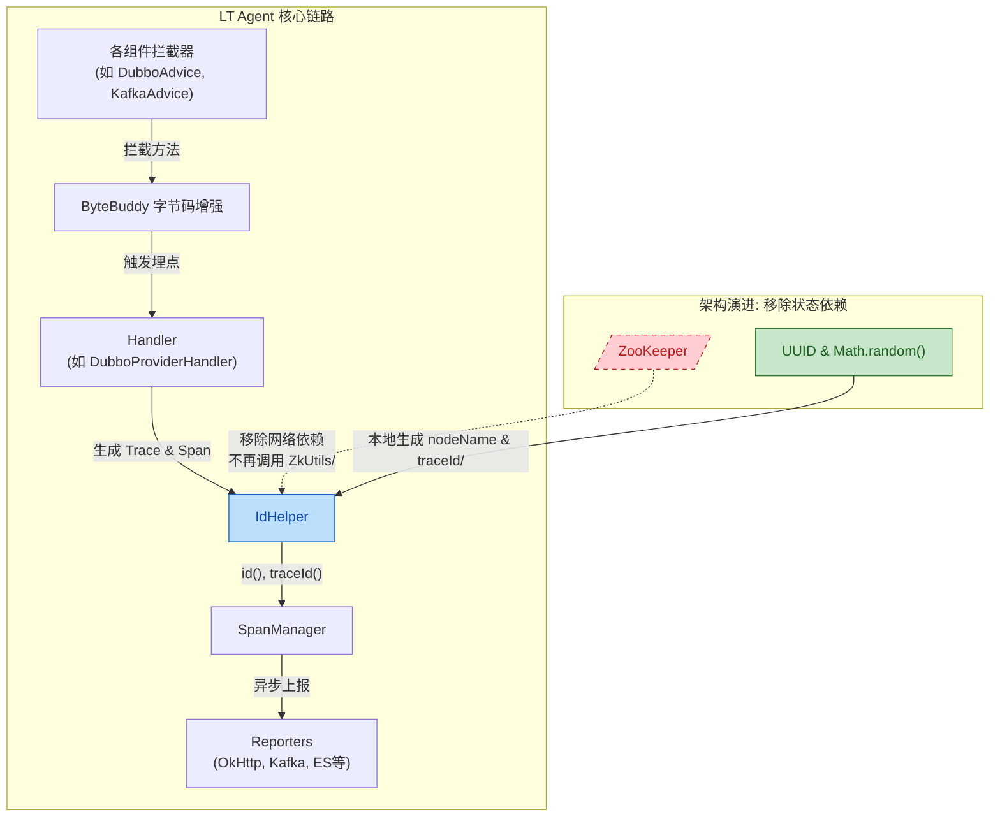

## 1. High-Level Summary (TL;DR)
* **Impact:** **High** - 本次提交包含核心架构的重大重构、项目的全面品牌重命名，以及监控生态的巨大扩展。
* **Key Changes:**
  * **品牌与模块重命名**：将项目从 `LtMonitor` 全面重命名为 **LT监控系统 (LT Monitor)**，重构了所有核心模块（如 `lt-monitor-agent` 变为 `lt-agent`，`lt-monitor-server` 变为 `lt-server-apm`）。
  * **移除 ZooKeeper 依赖**：移除了分布式 ID 生成对 ZooKeeper 的依赖，改为基于本地随机分配和 UUID 的无状态实现，大幅降低了 Agent 的部署复杂度和外部依赖。
  * **生态插件大爆发**：新增了对十余种主流中间件和微服务框架的追踪支持，包括 Dubbo、Apollo、Nacos、Kafka、Redis、Sentinel、Seata 等。

## 2. Visual Overview (Code & Logic Map)

## 3. Detailed Change Analysis

### 📦 项目重命名与包结构调整 (Project Rebranding)
* **What Changed:** 项目进行了整体品牌迁移。不仅更改了说明文档中的名称，还大范围修改了 Maven 模块结构和部分核心代码的包路径（从 `org.xi.lt` 逐渐向 `org.xi.lt` 迁移）。

| Original Name | New Name | Reason |
| --- | --- | --- |
| `lt-monitor-agent` | `lt-agent` | 匹配 LT Monitor 品牌 |
| `lt-monitor-server` | `lt-server-apm` | 服务端模块重命名 |
| `lt-monitor-ui` | `lt-ui-old` / `lt-monitor-ui-server` | UI 模块重命名及归档 |
| `org.xi.lt.*` | `org.xi.lt.*` (部分新增插件) | 基础包命名空间迁移 |

### 🏗️ 架构变更：无状态 ID 生成 (Core Architecture)
* **What Changed:** 彻底移除了 Agent 端对 ZooKeeper 的依赖。原逻辑中 `IdHelper.java` 会连接 ZK 创建 `id.zk.url` 节点以分配全局唯一的 `nodeName`。重构后，`nodeName` 改为本地随机生成（`1000 + Math.random() * 8999`），并且引入了 `UUID.randomUUID()` 来生成 `traceId()` (Source: `IdHelper.java`)。这一改动使 Agent 变成了纯无状态节点，极大地降低了部署门槛。

### 🔌 生态插件扩展 (New APM Plugins)
* **What Changed:** 为 `lt-agent` 引入了大量的 ByteBuddy 拦截器插件，以捕获更多现代 Java 生态系统的调用链路和性能数据。

| 组件类型 | 新增支持的框架/中间件 |
| --- | --- |
| **RPC & 网关** | Dubbo, Feign, Spring Cloud Gateway |
| **服务治理 & 配置** | Apollo, Nacos, Hystrix, Resilience4j, Sentinel, Seata |
| **消息队列** | Kafka, RabbitMQ, RocketMQ |
| **数据存储 & 缓存** | Redis, MongoDB, Elasticsearch, ShardingJDBC |
| **任务调度** | XxlJob |

## 4. Impact & Risk Assessment
* ⚠️ **Breaking Changes (破坏性变更):** 
  * 所有的启动脚本、打包产物名称、以及旧版的 `lt-monitor` 配置项均已失效。如果现有环境依赖旧的 ZK 节点或旧包名进行自定义插件开发，将发生编译或运行时错误。
* 🐛 **Testing Suggestions (测试建议):** 
  * **ID 碰撞测试：** 由于 `IdHelper` 中的 `nodeName` 采用 1000~9999 之间的随机数生成，在超大规模（数万实例）部署时存在碰撞概率。建议评估 Trace ID 生成的唯一性。
  * **插件兼容性测试：** 重点验证新增的核心链路插件（如 Dubbo、Spring Cloud Gateway）的上下文传递（Context Propagation）是否在跨进程调用时正常携带了全新的 `traceId`。